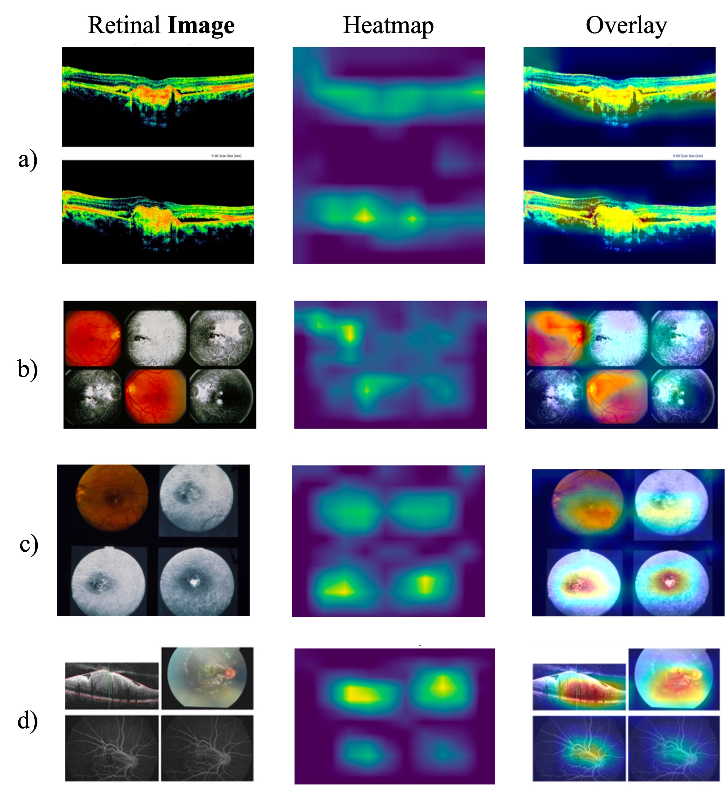

# GCS-M3VLT: Guided Context Self-Attention based Multi-modal Medical Vision Language Transformer for Retinal Image Captioning

This paper has been accepted at IEEE International Conference on Acoustics, Speech, and Signal Processing (ICASSP), 2025

[[IEEE Xplore]](https://ieeexplore.ieee.org/document/10890310) | [[arXiv]](https://arxiv.org/abs/2412.17251))

## Table of Contents
1. [Abstract](#abstract)
2. [Architecture](#architecture)
3. [Quantitative Evaluation](#quantitative-evaluation)
4. [Qualitative Evaluation](#qualitative-evaluation)
5. [Citation](#citation)
6. [License](#license)

## Abstract
Retinal image analysis is crucial for diagnosing and
treating eye diseases, yet generating accurate medical reports
from images remains challenging due to variability in image
quality and pathology, especially with limited labeled data.
Previous Transformer-based models struggled to integrate visual
and textual information under limited supervision. In response,
we propose a novel vision-language model for retinal image
captioning that combines visual and textual features through a
guided context self-attention mechanism. This approach captures
both intricate details and the global clinical context, even in
data-scarce scenarios. Extensive experiments on the DeepEyeNet
dataset demonstrate a 0.023 BLEU@4 improvement, along with
significant qualitative advancements, highlighting the effective-
ness of our model in generating comprehensive medical captions.

## Architecture
Our approach consists of four key modules:
1. **Vision Encoder**: Gets the attended feature representations of a retinal scan.
2. **Language Encoder**: Gets the attended embeddings of a keyword.
3. **TransFusion Encoder**: Fuses both vision and language features via cross-attention.
4. **Language Generation Decoder**: Generates the language taking in fused representations.
   


## Quantitative Evaluation
Comparative Study of Recent Best Models with Proposed Guided Context Self-Attention based Multi-modal Medical Vision Language Transformer trained on DeepEyeNet Dataset.
| Model                                      | B@1  | B@2  | B@3  | B@4  | CIDEr | ROUGE |
|--------------------------------------------|------|------|------|------|-------|-------|
| DeepOpth [Huang et al., 2021]             | 0.184 | 0.114 | 0.068 | 0.032 | 0.361 | 0.232 |
| Deep Context Encoding [Huang et al., 2021] | 0.219 | 0.134 | 0.074 | 0.035 | 0.398 | 0.252 |
| Contextualized GPT [Huang et al., 2021]    | 0.203 | 0.142 | 0.100 | 0.073 | 0.389 | 0.211 |
| Non-local Attention [Huang et al., 2022]   | 0.230 | 0.150 | 0.094 | 0.053 | 0.370 | 0.291 |
| Gated Contextual Transformer [Shaik et al., 2024] | 0.297 | 0.230 | 0.214 | 0.142 | 0.462 | 0.391 |
| VisionGPT [Kelly et al., 2024]            | 0.353 | 0.280 | 0.261 | 0.182 | 0.491 | 0.412 |
| Expert Transformer [Wu et al., 2023]      | 0.382 | 0.291 | 0.237 | 0.186 | 0.472 | 0.413 |
| LlaVA-Med [Li et al., 2024]               | 0.386 | 0.305 | 0.282 | 0.196 | 0.482 | 0.427 |
| M3 Transformer [Shaik et al., 2024]       | 0.394 | 0.312 | 0.291 | 0.208 | 0.537 | 0.429 |
| **GCS-M3VLT (Ours)**                      | **0.430** | **0.345** | **0.319** | **0.231** | **0.559** | **0.497** |

## Qualitative Evaluation
Multi-modal Attention Maps



### Citation
If you find GCG useful for your research and applications, please cite using this BibTeX:
```bibtex
@inproceedings{cherukuri2025gcs,
  title={GCS-M3VLT: Guided Context Self-Attention based Multi-modal Medical Vision Language Transformer for Retinal Image Captioning},
  author={Cherukuri, Teja Krishna and Shaik, Nagur Shareef and Bodapati, Jyostna Devi and Ye, Dong Hye},
  booktitle={ICASSP 2025-2025 IEEE International Conference on Acoustics, Speech and Signal Processing (ICASSP)},
  pages={1--5},
  year={2025},
  organization={IEEE}
}
```

### License

This project is licensed under the MIT License. See `LICENSE` for details.
